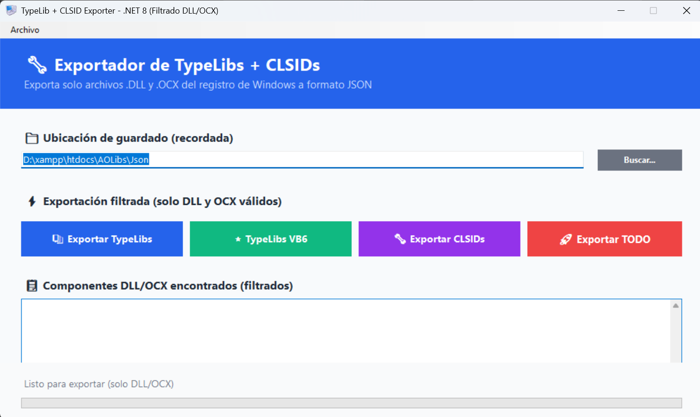
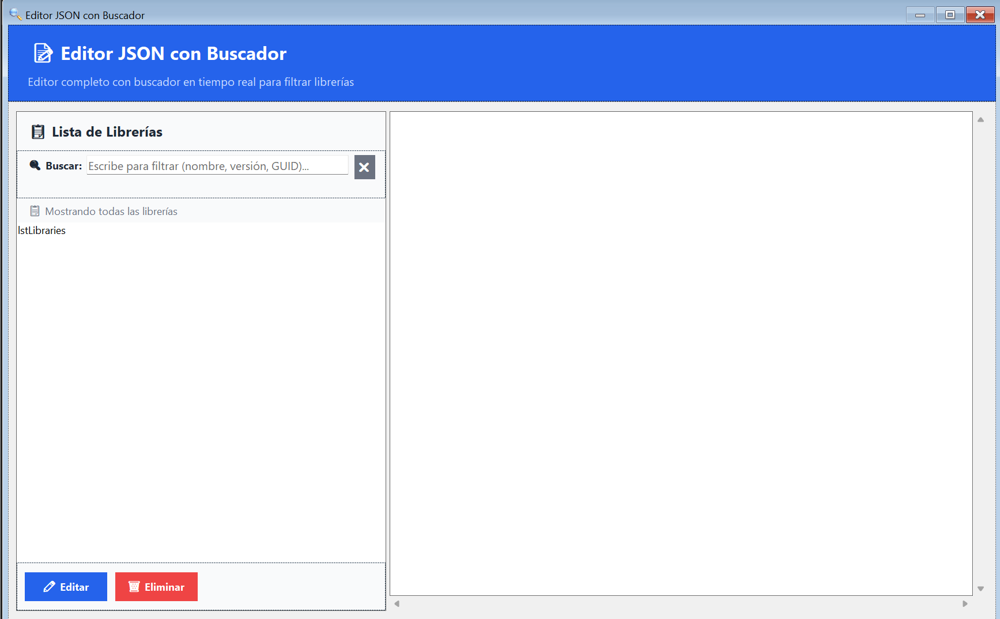

# TypeLibExporter_NET8

Aplicación de escritorio Windows Forms (.NET 8) para:

- Exportar información de TypeLibs registradas (filtradas a DLL/OCX) a JSON.
- Exportar CLSIDs con rutas de archivo válidas y metadatos (versión, tamaño, checksum) a JSON.
- Exportar un JSON combinado con TypeLibs y CLSIDs.
- Visualizar, buscar, editar y gestionar los JSON generados desde una UI dedicada.

## Capturas de pantalla

Vista principal:



Editor/visor JSON con buscador:



## Requisitos

- Windows 7 SP1 o superior (propiedad `SupportedOSPlatformVersion` = 6.1).
- .NET 8 SDK.
- Visual Studio 2022 o `dotnet CLI`.

## Descargas

- Versión pre-release v0.1.0Beta (Windows x64, self-contained, single-file):
  - [TypeLibExporter_NET8_v0.1.0Beta_win-x64.zip](https://github.com/scorpio21/Buscar_TypeLib/releases/download/v0.1.0Beta/TypeLibExporter_NET8_v0.1.0Beta_win-x64.zip)
  - O visita la pestaña [Releases](https://github.com/scorpio21/Buscar_TypeLib/releases/tag/v0.1.0Beta)

## Compilar y publicar (VS 2022 y CLI)

### Visual Studio 2022

1. Abre la solución `TypeLibExporter_NET8.sln`.
2. Establece configuración `Release` para distribuir.
3. Compilar (Build → Build Solution):
   - EXE dependiente del framework: `TypeLibExporter_NET8/bin/Release/net8.0-windows/TypeLibExporter_NET8.exe`.
4. Publicar (clic derecho proyecto `TypeLibExporter_NET8` → Publish…):
   - Target: `Folder`.
   - Runtime: `win-x64`.
   - Self-contained: `true` (no requiere .NET en destino; tamaño mayor).
   - Single file: `true` (opcional, un único `.exe`).
   - Ubicación de salida típica: `TypeLibExporter_NET8/bin/Release/net8.0-windows/win-x64/publish/`.

## Estructura del proyecto

- `TypeLibExporter_NET8/` Proyecto WinForms principal.
  - `Program.cs`: punto de entrada de la aplicación.
  - `Principal.cs` y `.Designer.cs`: ventana principal; gestiona exportaciones y UI (delegando en servicios).
  - `ListarJson.cs` y `.Designer.cs`: visor/gestor de archivos JSON.
  - `Servicios/ArchivoUtil.cs`: utilidades de archivos (versión, checksum, tamaño, formateo de tamaño) y validación `.dll/.ocx`.
  - `Servicios/RegistroScanner.cs`: escaneo del Registro para TypeLibs y CLSIDs con filtrado y validaciones.
  - `TypeLibExporter_NET8.csproj`: configuración del proyecto (.NET 8, WinForms, advertencias).
  - `bin/`, `obj/`: artefactos de compilación (ignorados por Git).

## Compilación y ejecución

Con Visual Studio:

1. Abrir `TypeLibExporter_NET8.sln`.
2. Establecer `TypeLibExporter_NET8` como proyecto de inicio.
3. Compilar y ejecutar.

Con `dotnet CLI`:

```bash
# Compilar en Debug
dotnet build TypeLibExporter_NET8/TypeLibExporter_NET8.csproj -c Debug

# Ejecutar
dotnet run --project TypeLibExporter_NET8/TypeLibExporter_NET8.csproj
```

## Uso rápido

1. En la ventana principal selecciona la ubicación de guardado.
2. Usa uno de los botones:
   - `Exportar TypeLibs`: recorre el registro `TypeLib` y genera `librerias-typelibs.json` (solo DLL/OCX).
   - `Exportar VB6 clásicas`: genera `librerias-vb6-clasicas.json` con un subconjunto preferido.
   - `Exportar CLSIDs`: genera `clsids-limpios-dll-ocx.json` con archivos existentes válidos.
   - `Exportación combinada`: genera `componentes-dll-ocx-completos.json` con ambos conjuntos.
3. Para visualizar un JSON, menú `Archivo → Utilidades → Cargar JSON` y selecciona el archivo.

## Decisiones y convenciones de código

- Idioma del código: español en comentarios, textos UI y documentación.
- Nombres descriptivos y coherentes para clases/métodos/propiedades.
- Manejo de errores con mensajes claros al usuario y sin detalles sensibles.
- `Nullable` activado y algunas advertencias suprimidas según `csproj`.
- Filtrado estricto a componentes `.dll` y `.ocx` en el escaneo de registro.

## Próximas mejoras sugeridas

- Seguir reduciendo `Principal.cs` y `ListarJson.cs` por debajo de 300 líneas moviendo más lógica de UI repetitiva a helpers específicos si fuera necesario.
- La lógica de parseo/serialización de `ListarJson.cs` ya se separó en `Servicios/JsonInspector.cs`.
- Documentar métodos públicos con comentarios XML en español (resumen, parámetros y retorno).
- Añadir proyecto de pruebas (`tests/`) con pruebas a funciones críticas (p. ej.: formateo de tamaño, validación de rutas, cálculo de checksum).
- Añadir logging estructurado opcional para diagnóstico (solo Debug).

## Git y buenas prácticas

- No comitear artefactos de compilación (`bin/`, `obj/`, `.vs/`, archivos `.user`).
- Hacer commits frecuentes con mensajes claros (en español).
- No subir credenciales, datos sensibles ni exportaciones de usuario sin consentimiento.

## Novedades v0.1.0Beta

- UI más moderna:
  - Botones con bordes redondeados, efectos hover/pressed y sombras sutiles en paneles.
  - Divisor inferior en el encabezado para mejor separación visual.
- Refactor de `Principal` a parciales:
  - `Principal.Helpers.cs`, `Principal.Events.cs`, `Principal.Export.cs` para un código más mantenible.
- Cursores direccionales personalizados en botones:
  - Soporte para `puntero-left.cur` y `puntero-right.cur` (cambia según el movimiento).
- Estabilidad al cerrar:
  - Correcciones para evitar `ObjectDisposedException` en efectos de hover.
- Layout más robusto:
  - `lstResults` con altura mínima dinámica y anclajes.
- Textos de UI centralizados en `ClaseInicial.Textos`.

Descargar release: consulta la pestaña Releases del repositorio y busca la etiqueta `v0.1.0Beta`.

## Licencia

Proyecto distribuido bajo la licencia **MIT**.

- Autor: By scorpio
- Repositorio: [github.com/scorpio21/Buscar_TypeLib](https://github.com/scorpio21/Buscar_TypeLib)

Consulta el archivo [`LICENSE`](LICENSE) para más detalles.
